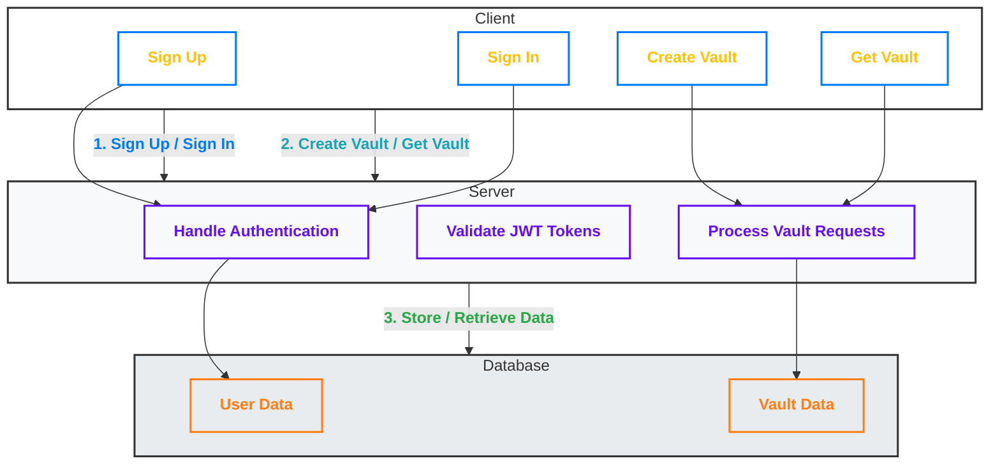

# GophKeeper

Welcome to the GophKeeper project, a secure client-server system that allows users to store and manage sensitive information like logins, passwords, binary data, and other private information. This project consists of two main components: the **Client** and the **Server**.

## Table of Contents

1. [Overview](#overview)
2. [Documentation Structure](#documentation-structure)
3. [Getting Started](#getting-started)
    - [Building the Client](#building-the-client)
    - [Building the Server](#building-the-server)
4. [Usage](#usage)
5. [System Architecture](#system-architecture)
6. [Further Documentation](#further-documentation)

## Overview

GophKeeper provides a secure way to store private data using a client-server architecture. The **Server** handles authentication, secure data storage, and communication with the client, while the **Client** allows users to interact with the server to store and retrieve sensitive information in personal vaults.

## Documentation Structure

The project includes two separate components, each documented in their own file:

- **[CLIENT.md](./CLIENT.md)**: Instructions and details on how to use the GophKeeper client. This file contains steps to build, configure, and run the client application, including commands for user sign-up, sign-in, and vault management.

- **[SERVER.md](./SERVER.md)**: Instructions for building, configuring, and running the GophKeeper server. This document covers server setup, configuration options, environment variables, and server commands.

## Getting Started

To get started with GophKeeper, you'll need to build both the server and client applications.

### Building the Client

To build the client application, navigate to the project directory and run:

```bash
go build -o client
```

For more detailed instructions, refer to the [CLIENT.md](./CLIENT.md) file.

### Building the Server

To build the server application, navigate to the server directory and run:

```bash
go build -o server
```

For detailed instructions on configuring and running the server, check the [SERVER.md](./SERVER.md) file.

## Usage

1. **Client Usage**: The client can be used to register, authenticate, and interact with secure vaults. The client supports commands for signing up, signing in, creating vaults, and retrieving vault data. Refer to the **[CLIENT.md](./CLIENT.md)** for specific commands and examples.

2. **Server Usage**: The server handles user authentication and storage of vault data. It should be configured properly with environment variables and flags to work securely. Full server configuration and usage instructions can be found in the **[SERVER.md](./SERVER.md)** file.

## System Architecture

The following Mermaid diagram illustrates the high-level architecture of the GophKeeper system and the interaction between the client, server, and database.



### Explanation:

1. **Client (User)**:
    - **Sign Up**: The user registers a new account, which is handled by the server.
    - **Sign In**: The user logs in, receiving a JWT token for authentication.
    - **Create Vault**: The user sends a request to store sensitive information (like passwords) in a vault.
    - **Get Vault**: The user retrieves data from the vault.

2. **Server**:
    - **Handle Authentication**: The server manages user registration and login, generating JWT tokens upon successful authentication.
    - **Validate JWT Tokens**: The server validates JWT tokens when the client makes requests.
    - **Process Vault Requests**: The server processes requests to create or retrieve vault entries.

3. **Database**:
    - **User Data**: Stores registered users and authentication information.
    - **Vault Data**: Stores secure vault entries (passwords, binary data, etc.).

## Further Documentation

- For client-specific operations, see **[CLIENT.md](./CLIENT.md)**.
- For server configuration and operation, see **[SERVER.md](./SERVER.md)**.

GophKeeper provides secure and encrypted storage, ensuring that sensitive data is stored safely while remaining easily accessible to authenticated users. Follow the detailed documentation to get the system up and running efficiently.

---

This update integrates the system architecture diagram into the main README for a clearer understanding of the project's structure.